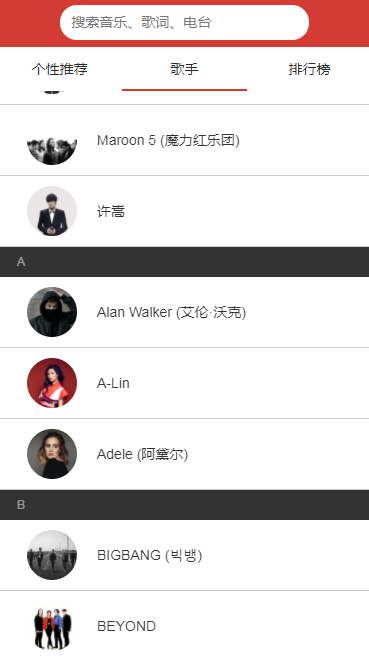

##  背景
此项目为利用空余时间做的一个 简易仿网易云音乐app的spa

## 技术栈：

react + react-router + redux + immutable + less + webpack


## 运行
```
 npm run dev (正常编译模式)

 npm run hot (热替换编译模式)

 访问 http://localhost:8088

 npm run dist （发布生产版本，对代码进行混淆压缩，提取公共代码，分离css文件）
```

## 项目达成度
1.支持搜索歌曲、专辑、mv

2.支持从搜索结果 播放歌曲  展示专辑或者歌单

3.支持查看歌手列表

4.支持查看歌手详情  以及 歌手热门歌曲和播放

5.支持 随机播放、单曲循环、列表循环三种播放模式

6.支持 上、下一首歌曲

7.支持 全屏播放器、mini播放器模式

8.支持筛选不同分类的MV


### 首页 

 

### 搜索页 

 

### 歌手列表

 

### 歌手专辑  


### 播放器  


### mv分类列表  


